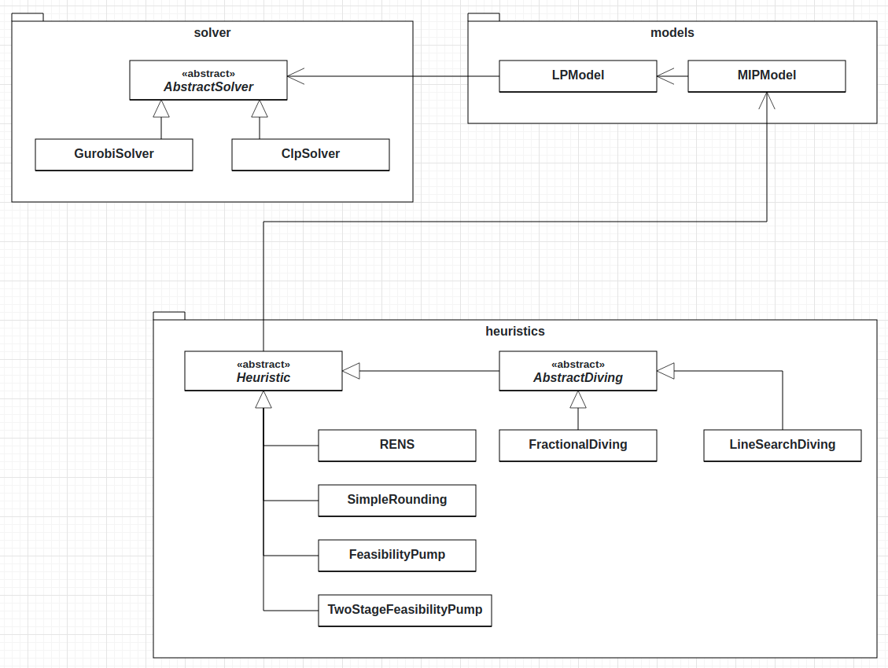

Developer API
=============
On this page, we elaborate on the concepts of HIPS and how to extend the existing functionality. Below
the core structure of HIPS is depicted in the UML diagram.

The ``solver`` package contains the linear programming solvers and can easily be extended.

The ``models`` package contains the :class:`hips.models.LPModel` and
:class:`hips.models.MIPModel` classes and interacts with the ``solver`` package. The :class:`hips.models.LPModel` class has a connection to a solver.
Under the hood, whenever the linear program represented by :class:`hips.models.LPModel` is changed, the changes are
directly redirected to the concrete solver. This means that the concrete solver (Gurobi or Clp) is constantly updated and
warm starts of the solvers are supported.

Lastly, the ``heuristics`` package contains the different heuristic implementations.

In the following sections we explain how to apply changes in the respective packages.

``solver`` package
------------------
The ``solver`` package contains the different linear programming solvers supported by HIPS.
Currently, :class:`hips.solver.GurobiSolver` and :class:`hips.solver.ClpSolver` are supported.
These classes inherit from the abstract class :class:`hips.solver._abstract_solver.AbstractSolver` and need to
implement various methods.

Adding a new solver
___________________
A new solver can be added by creating a class that inherits from :class:`hips.solver._abstract_solver.AbstractSolver`
and implements the different abstract methods. Please have a look at the documentation of the class below for details.

.. autosummary::
   :toctree: _autosummary
   :nosignatures:
   :recursive:

   hips.solver._abstract_solver.AbstractSolver

``models`` package
------------------
The ``models`` package contains all necessary classes to express linear and mixed integer programs in HIPS. As mentioned
before, the :class:`hips.models.LPModel` uses the solver interface to update the underlying linear program. Therefore, this
has to be kept in mind when applying changes to the ``models`` package.

``heuristics`` package
----------------------
The heuristics package contains the different heuristic implementations. Particularly, the two abstract classes :class:`hips.heuristics._heuristic.Heuristic`
and :class:`hips.heuristics._abstract_diving.AbstractDiving` are relevant when adding new heuristics.

Adding general MIP heuristics
_____________________________
A new heuristic can be added by inheriting from the :class:`hips.heuristics._heuristic.Heuristic` class. The class has
various abstract methods that need to implemented in the child class. Of particular interest is the
:func:`hips.heuristics._heuristic.Heuristic.compute` method that needs to implement the computation of the heuristic.
Please have a look at the documentation of the class for details.

Adding diving heuristics
________________________
When implementing new diving heuristics, it might be more appropriate to inherit from the
:class:`hips.heuristics._abstract_diving.AbstractDiving` class and implement the abstract methods there.
Particularly, only the :func:`hips.heuristics._abstract_diving.AbstractDiving.dive` and
:func:`hips.heuristics._abstract_diving.AbstractDiving.revert` methods need to be overriden.

The *dive* method should be overwritten to follow the specific branching condition of the diving heuristic to be implemented.
This means :func:`adding <hips.models._mip_model.MIPModel.add_constraint>` either a new constraint or
:func:`setting <hips.models._lp_model.LPModel.set_variable_bound>` the bound of a variable to restrict the feasible region
to the corresponding subproblem.

The *revert* method should be implemented to revert the MIP model to the state before any diving has happened. This method will
be called at the end of a diving heuristic run, independent of the outcome. This behaviour is vital in case the heuristic would be
used during the computations of another heuristic.

.. autosummary::
   :toctree: _autosummary
   :nosignatures:
   :recursive:

   hips.heuristics._abstract_diving.AbstractDiving
   hips.heuristics._heuristic.Heuristic